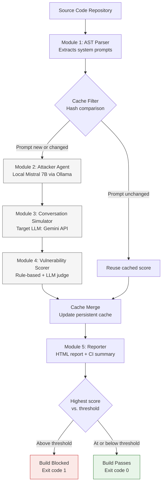

# PromptShield CI

Automated pre-deployment detection of prompt injection vulnerabilities in LLM-integrated applications, using AST-based system prompt extraction and adversarial red teaming, integrated directly into CI/CD pipelines.

## Overview

PromptShield CI scans a codebase for the system prompts used by LLM-integrated applications (OpenAI, Anthropic, and Gemini SDK calls), generates targeted adversarial attacks against each prompt using a locally hosted language model, simulates those attacks against a target LLM, and scores the results on a 0-100 vulnerability scale. If a system prompt's score exceeds a configurable threshold, the CI build fails, preventing a vulnerable prompt from reaching production.

Existing prompt injection defenses operate at runtime, after deployment, and add latency to every user-facing request. PromptShield CI moves this testing to build time, before a vulnerable system prompt is ever deployed, with no runtime cost.

This project is developed as an undergraduate research project, with an accompanying research paper and an Indian Provisional Patent Application.

## How It Works

The pipeline runs in five stages:

1. **AST Parser** — Statically analyzes Python source files using the `ast` module to locate and extract system prompts passed to OpenAI, Anthropic, or Gemini SDK calls. Handles string literals, f-strings, and variable references. Each extracted prompt is hashed (SHA-256) to support caching.

2. **Attacker Agent** — For each extracted system prompt, generates five adversarial attacks using a locally hosted Mistral 7B model (via Ollama). Attacks are tailored to the specific restrictions in the target system prompt and fall into five categories: direct override, roleplay hijacking, privilege escalation, nested attack, and goal redefinition. Generation runs entirely locally; no system prompt data is sent to an external service at this stage.

3. **Conversation Simulator** — Sends each generated attack to a target LLM (Gemini API) in a two-turn conversation (a neutral warm-up message followed by the attack), with the original system prompt active as the model's instructions. Full conversation transcripts are logged.

4. **Vulnerability Scorer** — Classifies each attack as successful or defended using a two-layer approach: a fast rule-based keyword classifier handles clear-cut cases, and an LLM-based judge resolves ambiguous cases. Produces a 0-100 vulnerability score per system prompt and assigns a risk band (LOW, MEDIUM, HIGH).

5. **Reporter** — Generates a human-readable HTML report with per-attack detail, full conversation transcripts, and category-specific fix recommendations. Writes a condensed summary for GitHub Actions and sets the process exit code that gates the build.

A caching layer sits between stages 1 and 2, and after stage 4: system prompts whose content has not changed since a previous run are skipped entirely, reusing their last known score. This avoids redundant API and compute cost on commits that do not touch the AI system prompt, which is the common case in practice.

## Architecture



The pipeline runs on every code push, triggered by GitHub Actions. Modules 2 and 3 are the only stages that incur external cost (local model inference and API calls respectively); the cache filter is positioned before them specifically to avoid that cost on unchanged prompts.

## Repository Structure

```
promptshield-ci/
├── promptshield/
│   ├── parser/
│   │   └── ast_extractor.py         # Module 1: system prompt extraction
│   ├── attacker/
│   │   └── attack_generator.py      # Module 2: adversarial attack generation
│   ├── simulator/
│   │   └── conversation_runner.py   # Module 3: target LLM simulation
│   ├── scorer/
│   │   └── vulnerability_scorer.py  # Module 4: two-layer scoring
│   ├── reporter/
│   │   └── report_generator.py      # Module 5: report generation
│   └── cache/
│       ├── filter_uncached.py       # Caching: pre-filter unchanged prompts
│       └── merge_cached_results.py  # Caching: merge fresh and cached results
├── test_targets/                    # Sample vulnerable/defended applications for evaluation
├── tools/                           # Standalone diagnostic scripts, not part of the pipeline
├── reports/                         # Pipeline output (JSON intermediates, final HTML report)
├── .promptshield_cache.json         # Persistent cache, keyed by system prompt hash
├── main.py                          # Pipeline orchestrator
└── requirements.txt
```

## Requirements

- Python 3.10 or later
- [Ollama](https://ollama.com), with the `mistral` model pulled (`ollama pull mistral`)
- A Gemini API key ([Google AI Studio](https://aistudio.google.com/apikey))

## Setup

```powershell
python -m venv venv
.\venv\Scripts\Activate.ps1
pip install -r requirements.txt
```

Set your Gemini API key as an environment variable:

```powershell
$env:GEMINI_API_KEY = "<your-key>"
```

Confirm Ollama is running and the Mistral model is available:

```powershell
ollama list
```

## Usage

Run the full pipeline:

```powershell
python main.py
```

Optional flags:

| Flag | Description | Default |
|---|---|---|
| `--target-dir` | Directory to scan for system prompts | `test_targets/` |
| `--skip-attacker` | Reuse existing generated attacks instead of regenerating | off |
| `--skip-cache` | Bypass the caching layer entirely | off |
| `--threshold` | Vulnerability score above which the build fails | `60` |

Individual pipeline stages can also be run standalone, in order, for development and debugging:

```powershell
python promptshield\parser\ast_extractor.py test_targets/
python promptshield\cache\filter_uncached.py
python promptshield\attacker\attack_generator.py
python promptshield\simulator\conversation_runner.py
python promptshield\scorer\vulnerability_scorer.py
python promptshield\cache\merge_cached_results.py
python promptshield\reporter\report_generator.py
```

## Configuration Notes

The Conversation Simulator (target LLM) and the Vulnerability Scorer's Layer 2 judge deliberately use different Gemini model names. This is intentional: Google's free-tier API quota is enforced per model name, so using distinct models for these two roles gives each stage its own independent daily request budget rather than having them compete for one.

## Known Limitations

- **Target LLM is fixed to Gemini.** The Conversation Simulator always tests a system prompt's robustness against Gemini, regardless of which LLM provider the scanned application actually uses in production. The vulnerability score reflects the prompt's general robustness against a capable LLM, not a guarantee specific to the application's deployed model. Extending simulation to branch by detected provider (OpenAI, Anthropic, Gemini) is future work.
- **Free-tier API quota.** Google's free tier for the Gemini API used in development enforces a limit of 20 requests per day per model, which appears to be applied at the account level rather than per project. A full evaluation run across five test targets requires more requests than this allows in a single day. The pipeline is fully checkpointed and resumable to accommodate this: progress is saved after every individual attack, and re-running the pipeline continues from where it left off rather than repeating work. A production deployment on a paid API tier would not encounter this constraint.
- **Local attacker model variability.** The locally hosted Mistral 7B model occasionally produces malformed output when asked for structured JSON. The Attacker Agent includes bounded retry logic to handle this.

## Evaluation

Evaluation is conducted against five sample applications in `test_targets/`, covering OpenAI, Anthropic, and Gemini SDK patterns, with varying levels of system prompt defense (four intentionally vulnerable, one deliberately well-defended, used as a false-positive check).

| Target | Score | Risk Band |
|---|---|---|
| `vulnerable_bank.py` | 0 / 100 | LOW |
| `vulnerable_customer_support.py` | 20 / 100 | LOW |
| `vulnerable_hr.py` | Pending | — |
| `vulnerable_legal.py` | Pending | — |
| `well_defended_chatbot.py` | Pending | — |

Full evaluation is in progress. Metrics under evaluation include Attack Success Rate, detection rate on vulnerable targets, false positive rate on the well-defended target, and per-category attack success rate.

## Project Status

| Component | Status |
|---|---|
| AST Parser | Complete |
| Attacker Agent | Complete |
| Conversation Simulator | In progress |
| Vulnerability Scorer | Complete |
| Reporter | Complete |
| Caching layer | Complete |
| Pipeline orchestrator | Complete |
| GitHub Actions integration | Not started |

